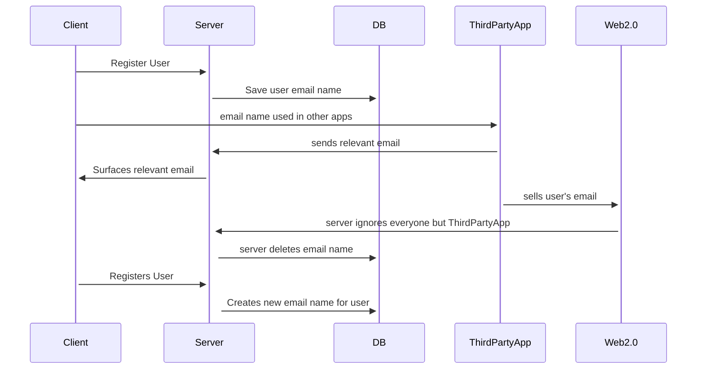
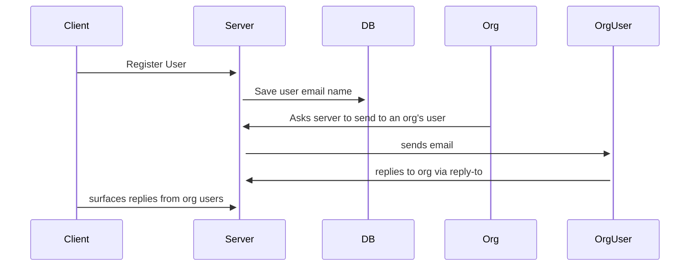

# Minnie

Minnie, named for [Minnie M. Cox][wikipedia] the first black woman to serve as postmaster in the US[^1], is _not_ a miniservice as it does not serve anything.
Instead I'm not sure if there is a good computer science term for what it is, so I'll call it a magic box.
This magic box listens for emails that you should get, and pushes buttons that other computers want you to push, so that you don't have to deal with the agita of the badge saying you have four thousand emails you haven't read.

This magic box also connects to a service called [resend][resend]. 
This service allows your base to send outgoing emails for receipts and things. 
You'll have to sign up for resend independently for that to work, and if you abuse this power, they will cut you off.

The magic box, like all magic, comes with limits and costs.
Use it wisely. 

## Overview

email is an umbrella term for a set of protocols that allow for a consistent user experience across email applications. 
Outboxes, inboxes, and email routing are the three constructs worth talking about, and I'll go through them here real quick in reverse order. 

If you're reading this, I'm going to assume you're familiar with the <name>@<address> construct for email addresses. 
The <address> portion is resolved mostly via the Domain Name System (DNS) as you would expect.
At the IP address found via DNS, there is a server listening on one of a handful of protocol-defined ports for incoming emails.

When an email is received, the server checks the <name> portion of the address, and if that name exists, it moves the email to the inbox.

Inboxes have been built with the assumption that you will be gleefully delighted when someone or something takes the time to email you.
I don't know about you, but it's been a minute since gleeful delight has been my associated feeling with respect to email.
So the point of minnie is to construct inboxes for users that they do not have to see at all. 

Spam gets ignored, receipts get auto-filed, 2fa messages get surfaced and then deleted, and your name cannot be used for tracking because it constantly changes. 

Which brings us to outboxes. 
Minnie's outbox is for the base it is running on, not for individual users. 
If you start giving your users email addresses to use, which you can, then you have very much missed the point of [allyabase][allyabase], and [The Advancement][the-advancement].

This means that this is _not_ an email server for users to have email on, but a _service_ that handles emails on the behalf of users to do other things.
If you are a business, your email for customers will be added as the reply-to in outgoing emails for customer service.
It is your responsibility to use your customer information responsibly.
The base can serve as a way of providing some protection from bad acting in this regard, but since I don't control the world's bases, there's only so much I can do.

But if I find out you're using bases to recreate Web2.0, you will have to deal with me competing with whatever you're trying to do.

## Usage

### Individual users

The intent of minnie is to keep the workings of email away from them having to handle it. 
As of this writing, I have 25,233 unread emails, a number so high it gives other people anxiety when I share my screen on zoom calls.
The idea is for people to not even have to worry about sifting through that number to find the three emails I have from friends eviting me to their kids' birthday parties. 



Once an email is off a base, Web2.0's gonna try and use it to sell that user things.
The only defense is for that user to not be tied to an email.
That's what minnie does, generate as many emails as the user needs to surf the web without accumulating spam.

### Groups (business, clubs, organizations, etc)

It is pretty trivial these days to get an email address and start sending emails through a service like resend.
The ability to do so through minnie is offered more as a convenience than a necessity. 
Rather than everyone on a base implementing their own email service, we can use minnie.

The base method provides some measure against spammers as humans are usually more reluctant to ruin things for their group than to take on punishment just for themselves. 
The base maintainer can also exclude bad actors based on whatever criteria they choose, so consider this approach double-gated.



email addresses are pii, and so minnie doesn't save them beyond their storage in messages sent so that minnie doesn't have a record of who is in what org.
This means the client should filter its information from minnie if desired.

## API

This API is oddly less involved than most of the CRUD APIs due to it trying to be a magic box.
Most of the complexity is handled is handled by the email protocols and minnie's internal logic. 
It's still pretty CRUDdy though :)

<details>
 <summary><code>POST</code> <code><b>/user/create</b></code> <code>Creates a new user if pubKey does not exist, and returns existing uuid if it does.
signature message is: timestamp + pubKey + hash</code></summary>

##### Parameters

> | name           |  required     | data type               | description                                                           |
> |--------------  |-----------|-------------------------|-----------------------------------------------------------------------|
> | pubKey         |  true     | string (hex)            | the publicKey of the user's keypair  |
> | timestamp      |  true     | string                  | in a production system timestamps prevent replay attacks  |
> | ttl            |  false    | int                     | days to keep name; defaults to 30; -1 will keep name indefinitely
> | isOrganization |  false    | bool                    | if true, will allow sending; defaults to false
> | signature      |  true     | string (signature)      | the signature from sessionless for the message  |


##### Responses

> | http code     | content-type                      | response                                                            |
> |---------------|-----------------------------------|---------------------------------------------------------------------|
> | `200`         | `application/json`                | `{"userUUID": <uuid>}`   |
> | `400`         | `application/json`                | `{"code":"400","message":"Bad Request"}`                            |

##### Example cURL

> ```javascript
>  curl -X PUT -H "Content-Type: application/json" -d '{"pubKey": "key", "timestamp": "now", "ttl": 100, "isOrganization": false, "signature": "sig"}' https://minnie.planetnine.app/user/create
> ```

</details>

<details>
 <summary><code>GET</code> <code><b>/user/:uuid/inbox?timestamp=<timestamp>&signature=<signature of (timestamp + uuid)></b></code> <code>Gets the user's curated inbox.j</code></summary>

##### Parameters

> | name         |  required     | data type               | description                                                           |
> |--------------|-----------|-------------------------|-----------------------------------------------------------------------|
> | timestamp    |  true     | string                  | in a production system timestamps prevent replay attacks  |
> | uuid         |  true     | string                  | the state hash saved client side
> | signature    |  true     | string (signature)      | the signature from sessionless for the message  |


##### Responses

> | http code     | content-type                      | response                                                            |
> |---------------|-----------------------------------|---------------------------------------------------------------------|
> | `200`         | `application/json`                | `{"inbox": {<timestamp>: <message>}}`   |
> | `404`         | `application/json`                | `{"code":"404","message":"Not found"}`                            |

##### Example cURL

> ```javascript
>  curl -X GET -H "Content-Type: application/json" https://minnie.planetnine.app/user/<uuid>?timestamp=123&signature=signature
> ```

</details>

<details>
  <summary><code>POST</code> <code><b>/user/:uuid/send</b></code> <code>Asks minnie to send an email on behalf of the user. minnie may or not allow this. signature message is: timestamp + userUUID + recipient</code></summary>

##### Parameters

> | name         |  required     | data type               | description                                                           |
> |--------------|-----------|-------------------------|-----------------------------------------------------------------------|
> | timestamp    |  true     | string                  | in a production system timestamps prevent replay attacks  |
> | userUUID     |  true     | string                  | the user's uuid
> | recipient    |  true     | string                  | the email address to send the email to
> | cc           |  false    | array of strings        | other emails to carbon copy
> | bcc          |  false    | array of strings        | other emails to blind carbon copy
> | body         |  true     | string                  | the body of the email
> | signature    |  true     | string (signature)      | the signature from sessionless for the message  |

##### Responses

> | http code     | content-type                      | response                                                            |
> |---------------|-----------------------------------|---------------------------------------------------------------------|
> | `200`         | `application/json`                | `{"success": true}`   |
> | `400`         | `application/json`                | `{"code":"400","message":"Bad Request"}`                            |

##### Example cURL

> ```javascript
>  curl -X POST -d '{"timestamp": 123, "recipient": "foo@bar.com", "cc": [], "bcc": [], "body": "Lorem ipsum", "signature": "foo"}' https://minnie.planetnine.app/user/:uuid/send
> ```

</details>

<details>
  <summary><code>DELETE</code> <code><b>/user/:uuid/delete</b></code> <code>Deletes the email name associated with the passed in uuid.
signature message is: timestamp + userUUID</code></summary>

##### Parameters

> | name         |  required     | data type               | description                                                           |
> |--------------|-----------|-------------------------|-----------------------------------------------------------------------|
> | timestamp    |  true     | string                  | in a production system timestamps prevent replay attacks  |
> | userUUID     |  true     | string                  | the user's uuid
> | signature    |  true     | string (signature)      | the signature from sessionless for the message  |

##### Responses

> | http code     | content-type                      | response                                                            |
> |---------------|-----------------------------------|---------------------------------------------------------------------|
> | `202`         | `application/json`                | empty   |
> | `400`         | `application/json`                | `{"code":"400","message":"Bad Request"}`                            |

##### Example cURL

> ```javascript
>  curl -X DELETE https://minnie.planetnine.app/user/:uuid/delete?timestampe=123&signature=foo
> ```

</details>

## Client SDKs

Client SDKs need to generate keys via Sessionless, and implement the networking to interface with the server.
To do so they should implement the following methods:

`createUser(ttl, isOrganization, saveKeys, getKeys)` - Should generate keys, save them appropriately client side, and PUT to /user/create.

`getInbox(uuid)` - get the inbox for a user

`send(uuid, recipient, body, cc, bcc)` - the email to send

`deleteUser(uuid)` - delete's the user's email name

## Use cases

**NOTE** minnie is experimental, and the instance at dev.minnie.allyabase.com is ephemeral, and may go away or reset at any time.

* 2fa
* receipts
* order tracking
* newsletters (maybe...)
* evites

## Contributing

To add to this repo, feel free to make a [pull request][pr].


[wikipedia]: https://en.wikipedia.org/wiki/Minnie_M._Cox
[resend]: https://resend.com/emails
[allyabase]: https://github.com/planet-nine-app/allyabase
[the-advancement]: https://github.com/planet-nine-app/the-advancement


[^1]: "Minnie is most well-known for Teddy Roosevelt's involvement in her being run out of office, and subsequently out of town by white racists. This undermines the fact that not only did she serve as postmistress, but also opened a bank, and insurance company to serve her community at a time when all three of these services were at best marginally available to women and people of color in the US."
